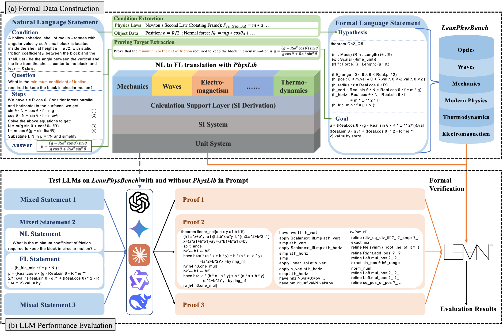

# Lean4Physics: Comprehensive Reasoning Framework for College-level Physics in Lean4



## Introduction
We present **Lean4PHYS**, a comprehensive reasoning framework for college-level physics problems in Lean4. To establish a solid foundation for formal reasoning in physics, **Lean4PHYS** launches *PhysLib*, a repository containing fundamental unit systems and essential theorems to formulate physics proofs in Lean4. It will be community-driven and long-term maintained. **Lean4PHYS** also includes *LeanPhysBench*, a college-level benchmark for evaluating LLMs' Lean4 formal physics reasoning capability. It contains 200 hand-crafted and peer-reviewed Lean4 theorem statements formalized from university textbooks and physics competition problems. Based on the *PhysLib* and *LeanPhysBench* we composed in Lean4PHYS, we perform exhaustive experiments of baseline results using major expert Math provers and state-of-the-art closed-source models, and provide an analysis of their performance. In the experiment, we identify that most expert provers do not outperform general models as they did in the math domain. This suggests potential overfitting to the math domain rather than learning formal reasoning for formal provers. We also conduct a comprehensive experiment showing that, with *PhysLib* in the context, LLMs' performance on *LeanPhysBench* increases by **11.90%** on average, proving the effectiveness of our repository in assisting LLMs in solving the Lean4 physics problem. To the best of our knowledge, we are the first study to provide a physics benchmark in Lean4.

## Useful Links
- Please see the details in our full paper: [arxiv](https://arxiv.org/abs/2510.26094)

- Please see the documentation of *PhysLib* : [document](https://yuxin.li/Lean4PHYS_web/docs/)

## LICENSE and Usage
The PhysLib library is licensed with Apache-2.0, of which parts come from [teorth_analysis](https://github.com/teorth/analysis) , aligned with the origin repository. 
The LeanPhysBench dataset is licensed with CC BY-NC 4.0, aligned with the copyright protection range of the source materials. Additionally, the dataset may not be used to train, fine-tune, or evaluate any machine learning or AI models, regardless of whether the use is commercial or non-commercial. 

## News
[2026.3.5] 🔉 We have released the documentation for our enriched version of *PhysLib*. We will continue to improve the library and contributions from the community are more than welcome!
[2026.3.2] 🔉 We have uploaded our initial version of *PhysLib* and *LeanPhysBench*. A structured ducomentation of *PhysLib*, enriched version of *PhysLib*, and the evaluation pipline of *LeanPhysBench* will coming soon. 

## Citing Us
If you found our project useful, please cite us as: 
```
@article{li2025lean4physics,
  title={Lean4Physics: Comprehensive Reasoning Framework for College-level Physics in Lean4},
  author={Li, Yuxin and Liu, Minghao and Wang, Ruida and Ji, Wenzhao and He, Zhitao and Pan, Rui and Huang, Junming and Zhang, Tong and Fung, Yi R},
  year={2025},
  eprint={2510.26094},
  archivePrefix={arXiv},
  primaryClass={cs.AI},
  url={https://arxiv.org/abs/2510.26094}
}
```

## Contact Information 
For help or issues using Lean4PHYS, you can submit a GitHub issue, send messages in the [Zulip channel](https://leanprover.zulipchat.com/#narrow/channel/479953-PhysLean/topic/PhysLib/with/553660982), or send emials to Yuxin Li（ylinq@connect.ust.hk). 
